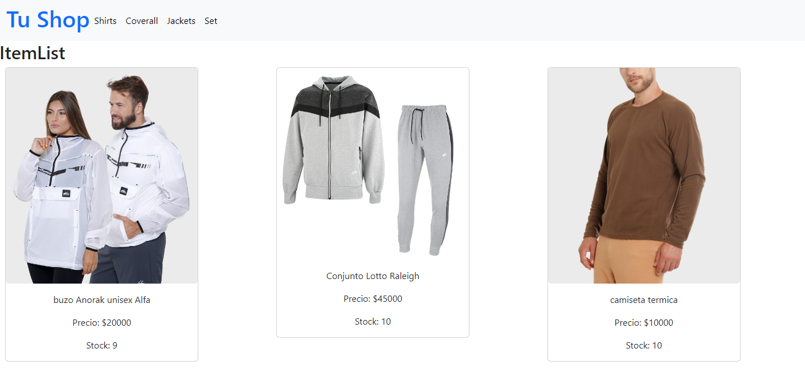
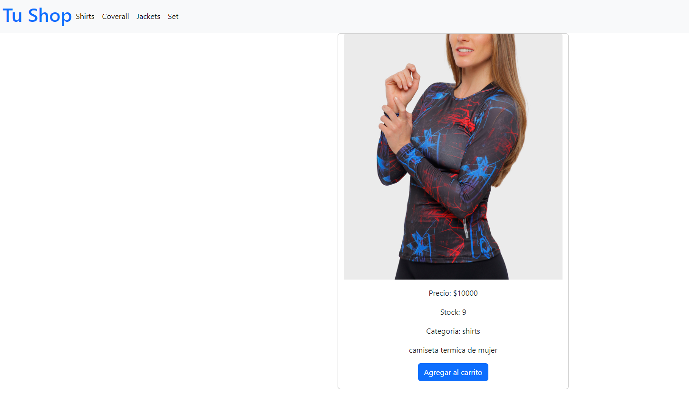
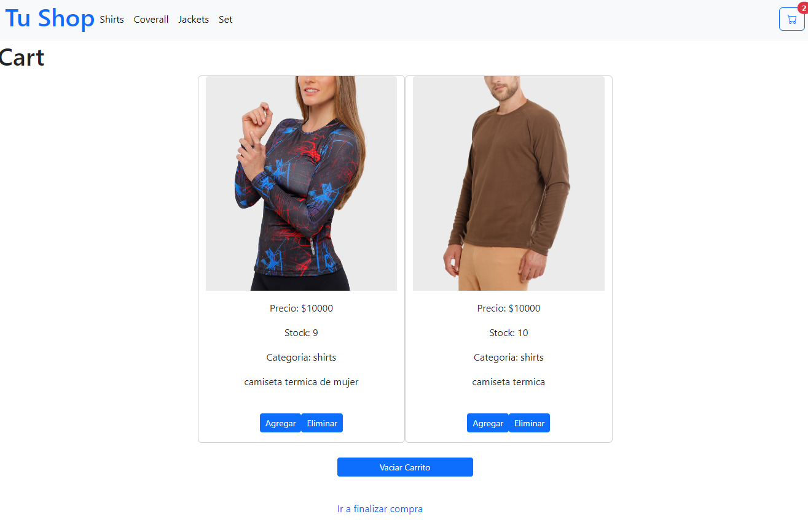
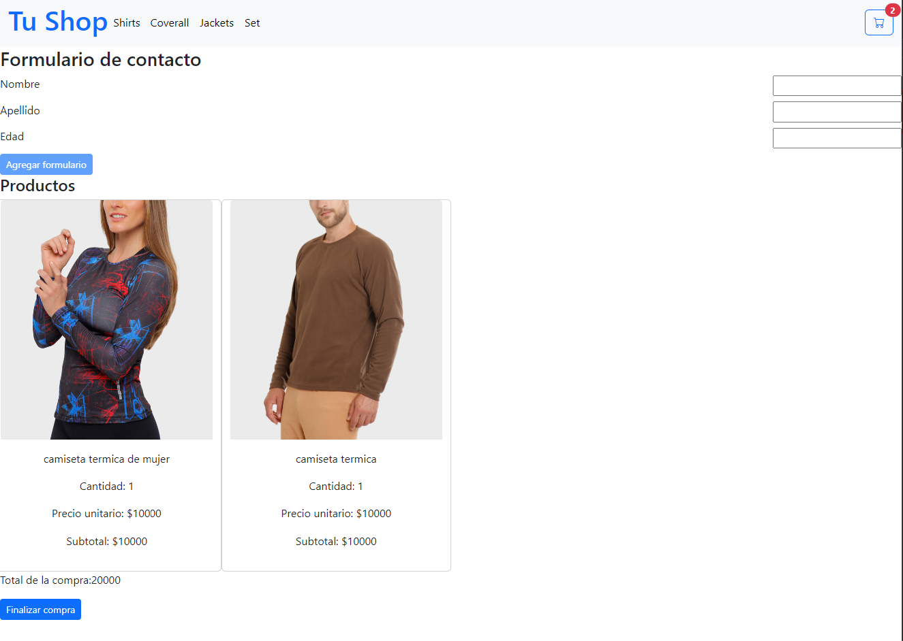

# Tu Shop - Tienda de Ropa

Tu Shop is an ecommerce that offers clothes products for sale. The project is created with the React library, using vite as a compilation tool. The styles were created with bootstrap.

## Table of Contents

1. [Description](#description)
2. [Screenshots](#screenshot)
3. [Characteristics](#characteristics)
4. [Demo](#demo)
5. [Requirements](#requirements)
6. [Installation](#installation)
7. [Use](#use)
8. [License](#license)

## Description

We offers both women and man clothes products for sale. It has a main page with all the products, and the option to filter by categories in the navigation bar.

## Screenshot

## Characteristics

- Product List.
- Filtering products by categories.
- Shopping cart and payment process.
- Form registration.
- Orders generation and backend storage of products in Firebase.

## Demo

[screen-capture.webm](https://github.com/augustocarminati/primera-preentega-augusto-carminati/blob/main/20230922_190911.mp4)

## Requirements

Before you start working on this project, make sure you meet the following requirements:

- **Node.js y npm:** You must have Node.js installed on your system. You can download it from [nodejs.org](https://nodejs.org/).

- **Git:** It is recommended to have Git installed to manage version control of your project. You can download it from [git-scm.com](https://git-scm.com/).

## Installation

Follow these steps to install and run the app:

1. Clone this repository to your local machine using Git: git clone https://github.com/augustocarminati/primera-preentega-augusto-carminati.git
2. Navigate to the project directory: cd pre-entrega.
3. Install the project dependencies using npm: npm install.
4. Start the application: npm run dev.
The application should be available on localhost, in your web browser.

For correct operation, you must have the environment variables of the .env file set:    
apiKey: import.meta.env.VITE_REACT_APP_apiKey,     
authDomain: import.meta.env.VITE_REACT_APP_authDomain,   
projectId: import.meta.env.VITE_REACT_APP_projectId,   
storageBucket: import.meta.env.VITE_REACT_APP_storageBucket,   
messagingSenderId: import.meta.env.VITE_REACT_APP_messagingSenderId,   
appId: import.meta.env.VITE_REACT_APP_appId,

## Use

The main section of the page has a list of all the products that the company offers, brought from the firebase database, firestore. The data for its use is found in the .env file, which is located at .gitignore to protect sensitive data. The images are saved in public folder. This page has a navigation bar, where you have the options to filter products by category.
Each productCart has an image, price, stock and description.
If you select and item product, by using a link you will be redirected to a new window that shows the product in detail. 
The add to cart button allows you to add more than one product without exceeding the stock limit. 
When adding products to the cart, the cart widget appears in the navbar with the number of products added. If you click the button, by using a link you will be redirected to a new window that shows all products in cart (description, price, quantity,etc). 
Once the products have been selected, click on "ir a finalizar compra" and you will be redirected to a new window where you can find a form with mandatory data that the customer must fill out, and then the "finalizar compra" button which allows you to complete the buy and get and order id to help you track the product bought.

